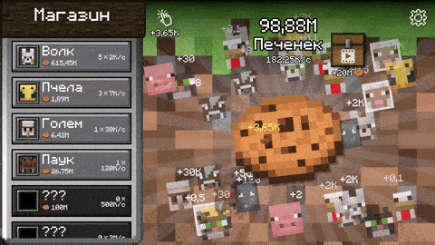

# Mine Clicker: Cookie!

📖 This README is also available in [Русский](README.ru.md)

## 🎮 About the Game

In this game, you click on a cookie to earn resources, then buy familiar creatures who help you earn even faster.

## 🚦 Project Status

🟩🟩🟩🟩🟩 — Completed

## 🛠 Tools Used

- Unity (6000.0.37f1)  
- DOTween  
- Zenject  
- Addressables  
- Plugin Your Games  
- Localization  

## 📺 Gameplay Preview

## 🌐 Localization

The game is fully translated into two languages:  
- Russian  
- English

## 📦 Asset List

Below are third-party assets and plugins not included in the repository.

| Asset Name                                                                                                                                                                   | Description          |
|------------------------------------------------------------------------------------------------------------------------------------------------------------------------------|----------------------|
| [Ultimate Clean GUI Pack](https://assetstore.unity.com/packages/2d/gui/ultimate-clean-gui-pack-154574?srsltid=AfmBOor6_dkeqlUujMWs6ZAYlJRsgQFqRwkcXYjMQ5Z2WGlQUWKW9XDc)      | Icons                |
| [Confetti FX 2](https://assetstore.unity.com/packages/vfx/particles/confetti-fx-2-170027)                                                                                    | Confetti effect      |
| [Casual SoundFX Pack](https://assetstore.unity.com/packages/audio/sound-fx/free-casual-game-sfx-pack-54116?srsltid=AfmBOopMpEfnp9Y53dl2BJqbnWdahrByzkm-aBF_wgTzoM3qa_Jv8hCZ) | Sounds               |
| [Plugin Your Games](https://max-games.ru/plugin-yg/)                                                                                                                         | SDK for WEB-platforms|         
